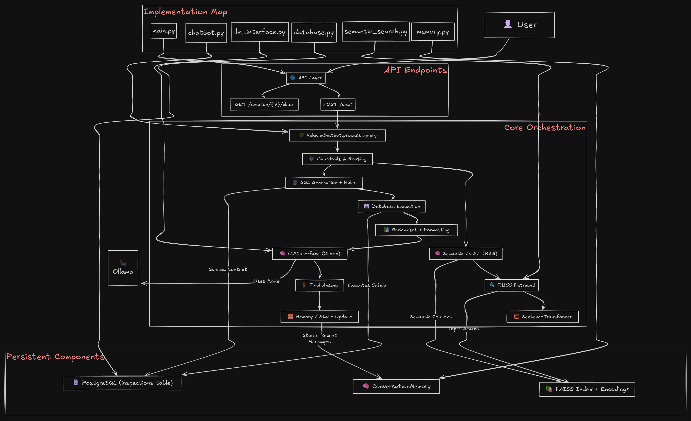
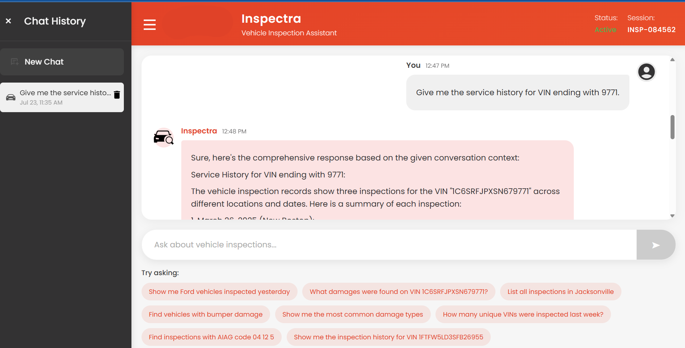

# Inspectra
A AI powered Vehicle Inspection Chatbot system that answers queries about inspection data using both SQL and semantic search. It integrates PostgreSQL, FAISS, and Ollama (Qwen LLM) to understand user queries, find relevant records, and generate clear, natural language responses via a FastAPI web service or CLI, ensuring efficient vehicle insights.

# Architecture Diagram 

# Plateform 

